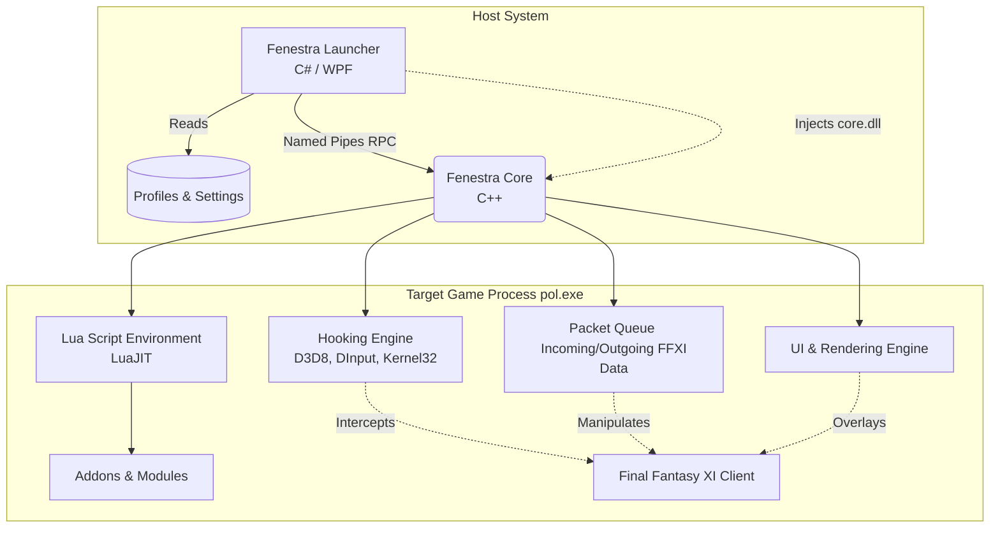

# Fenestra (VoliEdition)

Fenestra is the next-generation, open-source development version of Windower. Originally designed as the successor to Windower 4, Fenestra provides a modern, highly optimized architecture for extending Final Fantasy XI with custom UI elements, macros, packet manipulation, and Lua-based addons.

## 🏗 Architecture Overview

Fenestra is split into two primary components to ensure stability, performance, and maintainability:

1. **The Launcher (`/launcher`) - C# / WPF**
   - A modern desktop application responsible for managing user profiles, settings, and updates.
   - Handles the complex logic of locating the PlayOnline/FFXI installation (including Steam detection).
   - Manages process elevation and securely injects the Core DLL into the target game process.
   - Communicates with the injected core via Named Pipes (RPC).

2. **The Core (`/core`) - C++**
   - The heavily optimized injected payload (`core.dll`).
   - **Hooking Engine:** Intercepts DirectX (D3D8), DirectInput, and core Windows APIs to overlay custom graphics and capture user input without modifying game files.
   - **Packet Manager:** Safely intercepts and manipulates incoming and outgoing network data.
   - **Lua Environment:** Embeds LuaJIT to run custom Addons and scripts with near-native performance.
   - **UI Engine:** A custom rendering engine for drawing text, shapes, and complex UI widgets directly onto the game window.

## 📂 Directory Structure

* `/launcher/` - C# WPF application for the Fenestra Launcher.
* `/core/` - C++ source code for the injected `core.dll`.
  * `/core/src/addon/` - Lua environment and addon management.
  * `/core/src/hooks/` - API hooks for D3D8, DirectInput, user32, etc.
  * `/core/src/ui/` - Internal rendering engine and interactive widgets.
* `/extern/` - External dependencies (e.g., LuaJIT).
* `/installer/` - WiX toolset files for generating Windows installers.

## 🚀 Getting Started

*(Instructions for building the project will go here. E.g., Visual Studio requirements, vcpkg setup for C++ dependencies, and .NET SDK versions.)*

## 📜 License

This project is licensed under the MIT License - see the [LICENSE.md](LICENSE.md) file for details.
